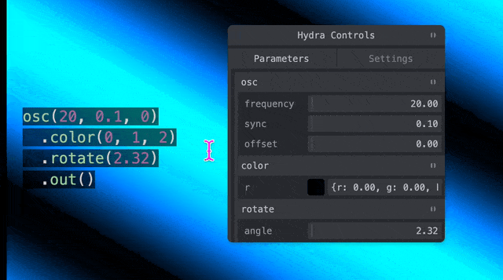

# hydra-mini-gui

A script for Hydra <https://hydra.ojack.xyz> that magically turns your code into an little sliders! It automatically creates a floating GUI that makes all your parameters draggable and tweakable in real-time.



"Pitschpatsch" is the sound German people make when stepping in puddles. ANd germans stepping into puddle kind of has the same chaotic (and orderly) energy as this script. –– its patschin & spatsching into your Hydra editor, maybe even executen other code tha youve written but when it works its quite fun

## Installation 📦

You can use Hydra Pitschpatsch in two ways:

### 1. Via URL (Quick Start)
```js
await loadScript("https://hydra-gui.milan.place/hydra-mini-gui.js")
```

### 2. Via npm
```bash
npm install hydra-pitschpatsch
# or with bun
bun add hydra-pitschpatsch
```

Then in your code:
```js
import 'hydra-pitschpatsch'
```

Then run a piece of code (Alt+Enter) to see the sliders

Try it live: <https://hydra-gui.milan.place>

## Features ✨

- 🔍 Automatically detects numbers in your code
- 🎚️ Creates smooth, responsive sliders for every value
- 🔄 Updates your visuals in real-time as you play
  - secretly replaces the number with a variable and updates it on drag
- 📝 Keeps your code clean and readable
- 🎯 Makes precise adjustments a breeze

## A Little Example 🌈

```js
osc(40,0.1,0.8)
  .rotate(0.5)
  .out()
```

This creates magical sliders for:

- `40` (freqency)
- `0.1` (sync )
- `0.8` (offset)
- `0.5` (rotation)

## to be continued

This is an experimental plugin and your a very welome to participate in this project.